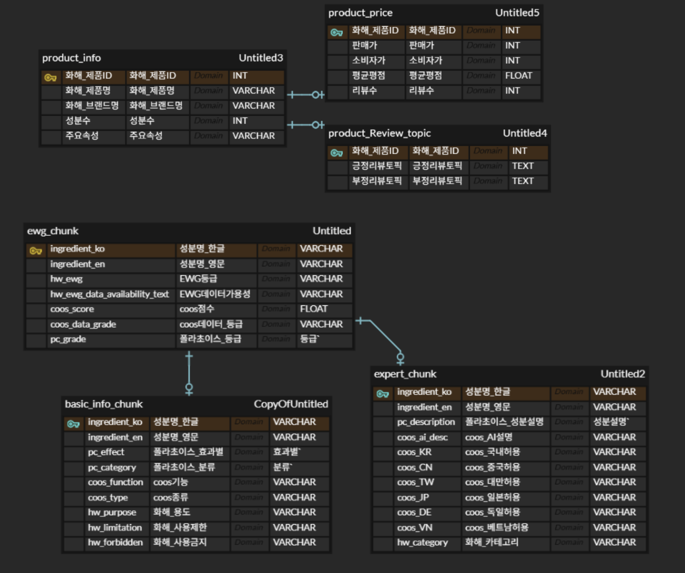
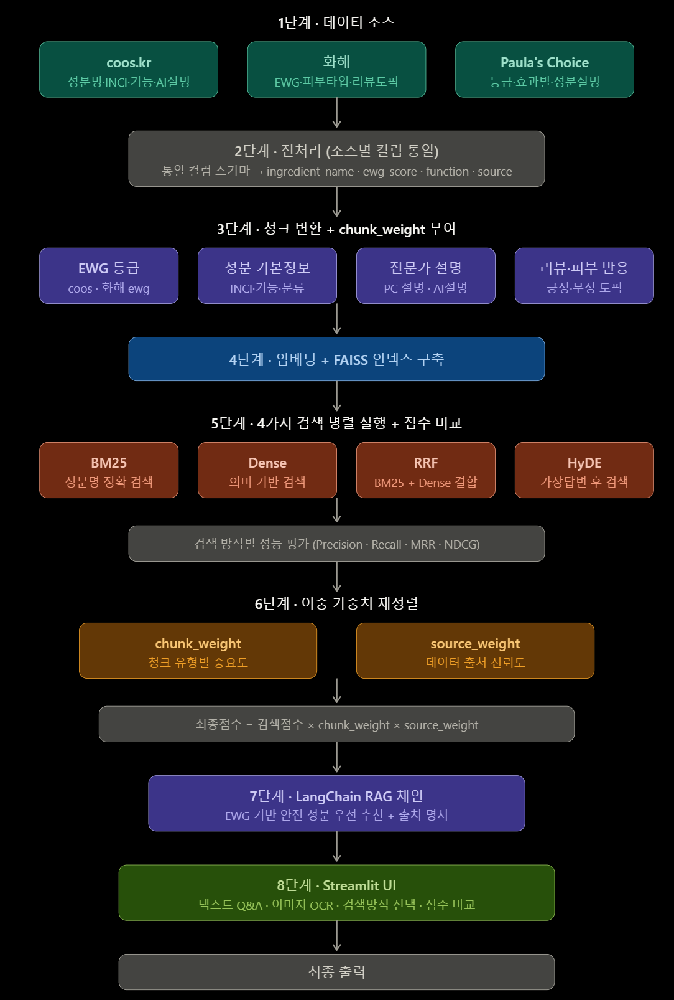

# ✨ Team Flow : 다중 소스 기반 지능형 화장품 성분 분석 서비스

> **이중 가중치 알고리즘과 하이브리드 검색을 활용한 맞춤형 성분 안전도 RAG 서비스**

---

## 팀 소개

<table>
  <tr align="center">
    <td><br><b>김민하</b></td>
    <td><br><b>배재현</b></td>
    <td><br><b>윤지혜</b></td>
    <td><br><b>전윤하</b></td>
    <td><br><b>정다솔</b></td>
    <td><br><b>홍진서</b></td>
  </tr>
  <tr align="center">
    <td>
      <a href="https://github.com/leedhroxx"></a><br>
      <b>GitHub 총괄 관리</b><br>검색 엔진 성능 평가<br>최적 지표 분석
    </td>
    <td>
      <a href="https://github.com/rshyun24"></a><br>
      <b>Vector DB 구축</b><br>FAISS 인덱스 구축<br>소스별 가중치 설계
    </td>
    <td>
      <a href="https://github.com/jjhhyy0926"></a><br>
      <b>프론트엔드 개발</b><br>Streamlit UI<br>EasyOCR 연동 구현
    </td>
    <td>
      <a href="https://github.com/yoonha315"></a><br>
      <b>데이터 엔지니어링</b><br>데이터 청크 변환<br>임베딩 모델 최적화
    </td>
    <td>
      <a href="https://github.com/soll07"></a><br>
      <b>RAG 파이프라인</b><br>LangChain 체인 구축<br>프롬프트 설계
    </td>
    <td>
      <a href="https://github.com/Hong-Jin-seo"></a><br>
      <b>Notion 체계 관리</b><br>Notion 환경 구축<br>가중치 알고리즘 개발
    </td>
  </tr>
</table>

---

## 프로젝트 기간
**2026.04.24 : 2026.04.27**

---

## 프로젝트 개요

### 배경
* 화장품 성분 정보의 파편화로 인해 소비자들은 여러 플랫폼을 번거롭게 교차 확인해야 하는 불편함 존재
* 단순 키워드 검색을 넘어 사용자의 피부 고민이나 전문가적 소견을 결합한 지능형 답변 시스템 필요
* 데이터 출처의 신뢰도와 정보 유형에 따른 정교한 데이터 랭킹 시스템 구축

### 주요 기능 및 목표
* **다중 소스 통합**: 약 9.4만 행의 방대한 데이터를 통합 스키마로 관리하여 정보의 누락 방지
* **고도화된 하이브리드 검색**: BM25와 Dense 검색을 RRF로 병합하여 키워드와 의미론적 맥락을 동시에 파악
* **이중 가중치 시스템**: 성분 중요도와 출처 신뢰도를 결합한 독자적인 가중치 알고리즘 적용

---

## 프로젝트 설계

### ERD (Entity Relationship Diagram)


### 데이터 정의 (Schema)
| 테이블명 | 설명 | 주요 컬럼 |
| :--- | :--- | :--- |
| **ewg_chunk** | 성분별 안전 등급 및 점수 | `ingredient_ko`, `hw_ewg`, `coos_score`, `pc_grade` |
| **basic_info_chunk** | 성분 기본 기능 및 카테고리 | `pc_effect`, `pc_category`, `coos_function`, `hw_purpose` |
| **expert_chunk** | 전문가 평가 및 국가별 기준 | `pc_description`, `coos_ai_desc`, `coos_KR`, `hw_category` |

### 프로젝트 아키텍처


---

## 폴더 구조
```text
project/
├── 00_data/
│   ├── 00_raw/                # 원본 데이터 (coos, 화해, PC)
│   │   └── categories/        # 화해 카테고리별 CSV
│   ├── 01_interim/            # 전처리 중간 산출물
│   └── 02_processed/          # 최종 RAG용 청크 데이터
│
├── 01_notebooks/
│   ├── 00_ingestion/          # 크롤링 노트북 (coos, 화해, PC)
│   ├── 01_preprocessing/      # 전처리·청킹·임베딩 노트북
│   ├── 02_features/           # 피처 실험
│   ├── 03_models/             # 모델 실험
│   ├── 04_training/           # 학습 실험
│   └── 99_sandbox/            # 프로토타입 (dasol_skin_curator, jaehyun_OCR, streamlit_dasol)
│
├── 02_src/
│   ├── 00_common/             # 설정 로더, 로거 유틸리티
│   ├── 01_data/               # 데이터 파이프라인
│   │   ├── 00_ingestion/      #   원본 로드 + 스키마 검증
│   │   ├── 01_preprocessing/  #   전처리·병합·청킹
│   │   └── 02_io/             #   JSON/CSV 읽기·쓰기
│   ├── 02_model/              # FAISS 인덱싱 및 RAG 로직
│   │   ├── 00_architectures/  #   임베딩 모델 팩토리
│   │   ├── 01_training/       #   학습 로직
│   │   ├── 02_inference/      #   추론 로직
│   │   └── 03_registry/       #   FAISS 빌드·저장·로드
│   └── 03_front/              # Streamlit UI
│       ├── 00_ui/             #   전역 CSS · 컴포넌트
│       ├── 01_views/          #   페이지별 뷰
│       ├── 02_state/          #   세션 상태 관리
│       ├── 03_viz/            #   시각화 모듈
│       └── 04_services/       #   API 클라이언트
│
├── 03_scripts/                # 파이프라인 자동화 스크립트
│   ├── 01_validate_raw.py     #   원본 데이터 검증
│   ├── 02_make_dataset.py     #   전처리 → merged JSON + product_db
│   ├── 03_build_features.py   #   청크 생성 (프리셋 1~4)
│   └── 04_train.py            #   임베딩 → FAISS 인덱스 구축
│
├── 04_configs/                # 중앙 설정 파일
│   └── config.yaml
│
├── 05_artifacts/              # 학습 산출물
│   ├── 00_models/             #   모델 체크포인트
│   ├── 01_preprocessors/      #   전처리기 저장
│   └── 02_metrics/            #   평가 지표
│
├── 06_runs/                   # 실험 실행 로그
├── 07_tests/                  # 테스트 코드
├── 08_pages/                  # Streamlit 멀티페이지
├── 09_assets/                 # README 이미지 및 ERD
│
├── app.py                     # 서비스 메인 실행 파일
├── requirements.txt
├── LICENSE
└── README.md
```
---
## 기술 스택

### Language : Frameworks
* 
* **LangChain** : **OpenAI GPT-4o-mini** 활용

### Embedding : Vector DB
* **Embedding Model**: OpenAI `text-embedding-3-small (1536d)` 활용 (768d 레거시 제거)
* **Vector DB**: `FAISS` (1536d 기본 설정)
* **Similarity Metric**: `similarity_search_with_relevance_scores()` 기반 정밀 Cosine Similarity 측정
  * $$ \text{similarity} = \cos(\theta) = \frac{\mathbf{A} \cdot \mathbf{B}}{\|\mathbf{A}\| \|\mathbf{B}\|} $$

### Search Logic
* **Hybrid Search**: BM25 + Dense RRF 병합 알고리즘
* **HyDE**: BM25 + Dense 통합 검색 기반 가상 답변 생성 로직 개선
* **OCR Module**: `EasyOCR` 성분 이미지 분석 모듈

---

## 데이터 출처
* **coos.kr**: 성분별 기능 및 국가별 규제 데이터
* **화해 (Hwahae)**: 사용자 리뷰 토픽 및 EWG 수치
* **Paula's Choice**: 성분별 전문가 평가 및 논문 근거 설명